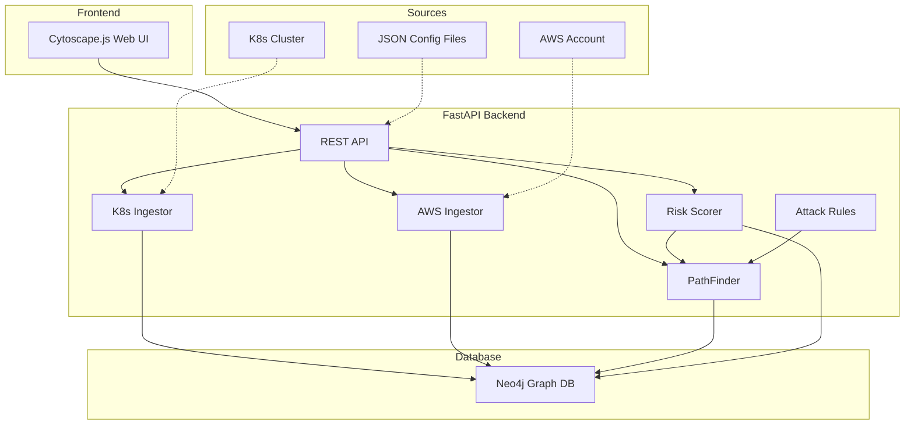

<p align="center">
  
  
  
  
</p>

# ⬡ KubePath

**Autonomous Cloud/K8s Lateral Movement Mapper**

> Think BloodHound, but built for Kubernetes clusters and AWS IAM. Feed it read-only credentials, and it spits out a beautiful interactive attack graph showing exactly how broken the target's permissions are.

KubePath ingests Kubernetes RBAC, network policies, pod security configurations, and AWS IAM policies, then maps out the exact lateral movement paths an attacker could take from a compromised web pod to cluster admin.

---

## ✨ Features

- 🔍 **Kubernetes Ingestion** — RBAC, pods, service accounts, network policies, secrets, services, nodes
- ☁️ **AWS IAM Ingestion** — Users, roles, groups, policies, trust relationships, AssumeRole chains
- 🕸️ **Attack Path Analysis** — Automated discovery of privilege escalation and lateral movement paths
- 📊 **Interactive Visualization** — Cytoscape.js force-directed graph with risk-colored nodes
- 🎯 **Risk Scoring** — Overall cluster security score (A–F) with factor breakdown
- 🔎 **Security Findings** — Automated detection of misconfigurations (privileged pods, wildcard RBAC, etc.)
- 🛡️ **MITRE ATT&CK Mapping** — All rules mapped to MITRE ATT&CK techniques
- 📁 **JSON Upload** — Upload configuration files directly for analysis without live cluster access
- 🐳 **Docker Compose** — One-command deployment with Neo4j included
- 📤 **Export** — PNG and JSON export of attack graphs

---

## 🏗️ Architecture



---

## 🚀 Quick Start

### Prerequisites

- **Python 3.11+**
- **Neo4j 5.x** (or Docker)
- **pip** or **pipx**

### Option 1: Docker Compose (Recommended)

```bash
git clone https://github.com/zshguy/KubePath.git
cd KubePath
docker-compose up --build
```

Open http://localhost:8000 in your browser.

### Option 2: Local Installation

```bash
# 1. Clone
git clone https://github.com/zshguy/KubePath.git
cd KubePath

# 2. Create virtual environment
python -m venv .venv
.venv\Scripts\activate  # Windows
# source .venv/bin/activate  # Linux/macOS

# 3. Install dependencies
pip install -r requirements.txt

# 4. Start Neo4j (must be running on bolt://localhost:7687)
# Download from https://neo4j.com/download/ or use Docker:
docker run -d --name neo4j -p 7474:7474 -p 7687:7687 \
  -e NEO4J_AUTH=neo4j/kubepath_secret \
  neo4j:5.26-community

# 5. Configure environment
copy .env.example .env
# Edit .env if needed

# 6. Start KubePath
python -m uvicorn kubepath.main:app --reload --host 0.0.0.0 --port 8000
```

Open http://localhost:8000 in your browser.

---

## 📖 Usage

### Ingest from Live Cluster

**Kubernetes:**
```bash
# Ensure your kubeconfig is configured
curl -X POST http://localhost:8000/api/v1/ingest/kubernetes
```

**AWS IAM:**
```bash
# Ensure AWS credentials are configured (env vars, profile, or IAM role)
curl -X POST http://localhost:8000/api/v1/ingest/aws \
  -H "Content-Type: application/json" \
  -d '{"region": "us-east-1"}'
```

### Upload JSON Config Files

Use the Web UI upload button, or:

```bash
curl -X POST http://localhost:8000/api/v1/ingest/file?source_type=kubernetes \
  -F "file=@sample_data/k8s_cluster.json"
```

### Try the Demo

Upload the included sample data files to see the tool in action:

```bash
# Upload sample K8s cluster config
curl -X POST http://localhost:8000/api/v1/ingest/file?source_type=kubernetes \
  -F "file=@sample_data/k8s_cluster.json"

# Upload sample AWS IAM config
curl -X POST http://localhost:8000/api/v1/ingest/file?source_type=aws \
  -F "file=@sample_data/aws_iam.json"
```

---

## 🔌 API Reference

| Method | Endpoint | Description |
|--------|----------|-------------|
| `GET` | `/api/v1/health` | Health check |
| `POST` | `/api/v1/ingest/kubernetes` | Ingest from live K8s cluster |
| `POST` | `/api/v1/ingest/aws` | Ingest from live AWS account |
| `POST` | `/api/v1/ingest/upload` | Upload JSON config |
| `POST` | `/api/v1/ingest/file` | Upload JSON file |
| `GET` | `/api/v1/graph` | Full graph data (Cytoscape format) |
| `GET` | `/api/v1/graph/node/{uid}` | Node detail with neighbors |
| `GET` | `/api/v1/analysis/paths` | Find attack paths to admin |
| `POST` | `/api/v1/analysis/path` | Find path between two nodes |
| `GET` | `/api/v1/analysis/critical` | Critical chokepoint nodes |
| `GET` | `/api/v1/analysis/entry-points` | External entry points |
| `GET` | `/api/v1/analysis/score` | Overall risk score |
| `GET` | `/api/v1/analysis/findings` | Security findings |
| `GET` | `/api/v1/analysis/rules` | Attack pattern rules |
| `GET` | `/api/v1/stats` | Graph statistics |
| `DELETE` | `/api/v1/graph` | Clear graph |

Full interactive API docs at `/api/docs` (Swagger UI).

---

## 🛡️ Attack Patterns Detected

KubePath detects the following attack patterns, mapped to MITRE ATT&CK:

| ID | Pattern | Risk | MITRE |
|----|---------|------|-------|
| K8S-PE-001 | Pod Creation → SA Token Theft | 🔴 CRITICAL | T1078.004 |
| K8S-PE-002 | Exec into Pod → Token Access | 🔴 CRITICAL | T1609 |
| K8S-PE-003 | Secret Read → Credential Theft | 🔴 CRITICAL | T1552.007 |
| K8S-PE-004 | RoleBinding Creation → Self-Escalation | 🔴 CRITICAL | T1098 |
| K8S-PE-005 | Privileged Pod → Host Escape | 🔴 CRITICAL | T1611 |
| K8S-PE-006 | Impersonate → Identity Theft | 🔴 CRITICAL | T1134 |
| K8S-PE-007 | Node Proxy → kubelet API | 🔴 CRITICAL | T1609 |
| K8S-LM-001 | Pod-to-Pod Network Access | 🟡 MEDIUM | T1210 |
| K8S-LM-002 | SA Token Reuse | 🟠 HIGH | T1550.001 |
| AWS-PE-001 | CreatePolicyVersion Escalation | 🔴 CRITICAL | T1098.003 |
| AWS-PE-002 | PassRole + Service → Admin | 🔴 CRITICAL | T1098.003 |
| AWS-PE-003 | AssumeRole Chain | 🟠 HIGH | T1550 |
| AWS-PE-004 | AttachPolicy Self-Escalation | 🔴 CRITICAL | T1098.003 |
| CE-001 | K8s Node → EC2 Metadata | 🔴 CRITICAL | T1552.005 |

---

## 🧪 Testing

```bash
# Unit tests (no Neo4j required)
python -m pytest tests/ -v

# Specific test files
python -m pytest tests/test_models.py -v
python -m pytest tests/test_ingestion.py -v
python -m pytest tests/test_analysis.py -v
```

---

## 📁 Project Structure

```
KubePath/
├── kubepath/               # Python backend
│   ├── main.py             # FastAPI application
│   ├── config.py           # Configuration
│   ├── models/             # Data models & enums
│   ├── ingestion/          # K8s & AWS ingestion engines
│   ├── analysis/           # Attack path analysis & scoring
│   ├── database/           # Neo4j client
│   └── api/                # REST API routes & schemas
├── frontend/               # Web UI (Cytoscape.js)
├── tests/                  # Test suite
├── sample_data/            # Demo config files
├── docker-compose.yml      # Docker deployment
├── Dockerfile
├── requirements.txt
└── pyproject.toml
```

---

## ⚠️ Security Notice

- KubePath operates with **read-only credentials only** — it never modifies any cluster or cloud configuration.
- The tool is designed for **authorized security assessments** only.
- Always obtain proper authorization before scanning any environment.
- Sample data files contain fictitious configurations for demonstration purposes.

---

## 🤝 Contributing

1. Fork the repository
2. Create a feature branch (`git checkout -b feature/amazing-feature`)
3. Commit your changes (`git commit -m 'Add amazing feature'`)
4. Push to the branch (`git push origin feature/amazing-feature`)
5. Open a Pull Request

---

## 📜 License

MIT License — see [LICENSE](LICENSE) for details.

---

<p align="center">
  <strong>Built for offensive security professionals.</strong><br>
  <sub>Use responsibly. Hack the planet. 🌍</sub>
</p>
